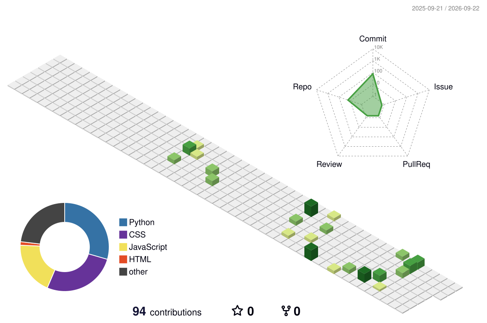

# 👋 Hi, I'm Karthikeya Korakoppula

<h3 align="center">
  🐍 Python Developer &nbsp; | &nbsp; 💻 Full Stack Developer &nbsp; | &nbsp; 🤖 AI/ML Enthusiast
</h3>

<p align="center">
  
</p>

<p align="center">
  <a href="https://github.com/korakoppulakarthikeya">
    
  </a>
  <a href="https://github.com/korakoppulakarthikeya?tab=followers">
    
  </a>
  <a href="https://github.com/korakoppulakarthikeya?tab=repositories">
    
  </a>
</p>

---

## 🚀 About Me

```python
class Karthikeya:

    def __init__(self):
        self.name = "Karthikeya Korakoppula"
        self.location = "India 🇮🇳"
        self.role = "Python Developer & Full Stack Developer"

        self.languages = [
            "Python",
            "JavaScript",
            "SQL"
        ]

        self.frontend = [
            "HTML5",
            "CSS3",
            "JavaScript",
            "React.js"
        ]

        self.backend = [
            "Python",
            "Flask",
            "Django",
            "REST APIs"
        ]

        self.database = [
            "MySQL",
            "SQL"
        ]

        self.libraries = [
            "NumPy",
            "Pandas",
            "Matplotlib"
        ]

        self.tools = [
            "Git",
            "GitHub",
            "VS Code",
            "Postman",
            "Jupyter"
        ]

        self.interests = [
            "Backend Development",
            "Full Stack Development",
            "AI/ML",
            "Problem Solving"
        ]

        self.current_focus = "Building scalable web applications"

    def life_loop(self):
        while True:
            self.learn()
            self.build()
            self.improve()
```

---

# 🛠️ Tech Stack

### 💻 Languages

<p align="center">
  
</p>

### 🌐 Frontend

<p align="center">
  
</p>

### 🐍 Backend

<p align="center">
  
</p>

### 🗄️ Database

<p align="center">
  
</p>

### 🧰 Tools

<p align="center">
  
</p>

---

# 📊 GitHub Analytics

<p align="center">
  
  
</p>

---

# 🔥 GitHub Streak

<p align="center">
  
</p>

---

# 📈 Contribution Activity

<p align="center">
  
</p>

---

# 🐍 Contribution Snake

<p align="center">
  
</p>

---

# 🧊 3D Contribution Calendar

<p align="center">
  
</p>

---

# 🚀 Featured Projects

<table>
<tr>

<td width="50%">

### 🌱 Precision Agriculture

**ML-powered agriculture platform**

* 🌾 Crop recommendation
* 📊 Crop yield prediction
* 🧪 Fertilizer recommendation
* 🦠 Plant disease detection
* 📱 Irrigation SMS alerts
* 🔐 OTP authentication

**Tech:** Python • Flask • ML • React • MySQL

</td>

<td width="50%">

### 🎙️ StreeVox

**AI-Based Voice Analysis**

* 🎤 Audio processing
* 🧠 ML-based analysis
* 📊 Feature extraction
* 🔊 Voice signal processing

**Tech:** Python • Librosa • NumPy • Scikit-learn

</td>

</tr>

<tr>

<td width="50%">

### 🎯 Number Guessing Game

React-based interactive guessing game.

**Tech:** React.js • JavaScript • CSS

<a href="https://github.com/korakoppulakarthikeya/guessgame">
  🔗 View Repository
</a>

</td>

<td width="50%">

### 🏠 House Price Prediction

Machine learning project for predicting house prices.

**Tech:** Python • Pandas • NumPy • Scikit-learn

</td>

</tr>
</table>

---

# 🧠 Currently Learning

```text
Python
  ├── Advanced Python
  ├── OOP
  └── DSA

Full Stack
  ├── React.js
  ├── Django
  ├── Flask
  └── REST APIs

Database
  ├── SQL
  ├── MySQL
  └── Database Design

AI / ML
  ├── Machine Learning
  ├── Feature Engineering
  └── Model Deployment
```

---

# 🎯 2026 Goals

* [x] Learn Python
* [x] Learn SQL
* [x] Learn Flask
* [x] Learn React
* [x] Build Full Stack Projects
* [ ] Master DSA
* [ ] Improve System Design
* [ ] Build Production-Level Applications
* [ ] Contribute to Open Source
* [ ] Get a Full Stack / Python Developer Role

---

# 📚 Skills

<p align="center">


</p>

---

# 🌐 Connect With Me

<p align="center">

<a href="https://github.com/korakoppulakarthikeya">

</a>

<a href="https://www.linkedin.com/">

</a>

</p>

---

# ⚡ Fun Fact

```text
while(alive):

    code()
    learn()
    build()
    solve_problems()

    if(error):
        debug()
        learn_from_it()
        try_again()
```

---

<h3 align="center">

💻 Code • 🧠 Learn • 🚀 Build • 🔥 Repeat

</h3>

<p align="center">
  
</p>
